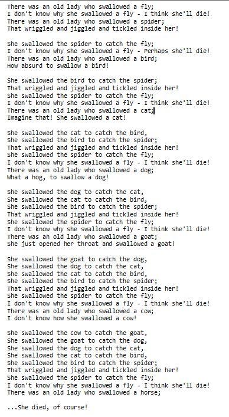

# TEALS Programming Projects, Chapter 1
 from 9/11/20

Each Java Project is a different project number from the book, such as #1 Mississippi and #3 Lady who swallowed a fly


**PP#1**  

##First Version had the below which allowed the caller to pass in an animal name as a parameter to make a full line
```
	private static void produceLadySwallowedAnimal(String animal) {
		String ladySwallowedFly = ladySwallowed + " " + animal + ";";
		System.out.println(ladySwallowedFly);
	}
```
         Second version, in order to stay within bounds of chapter one does not have methods with arguments
  
<p>&nbsp;</p>

<p>&nbsp;</p>

<p>&nbsp;</p>


**PP#3**

Output:

  

